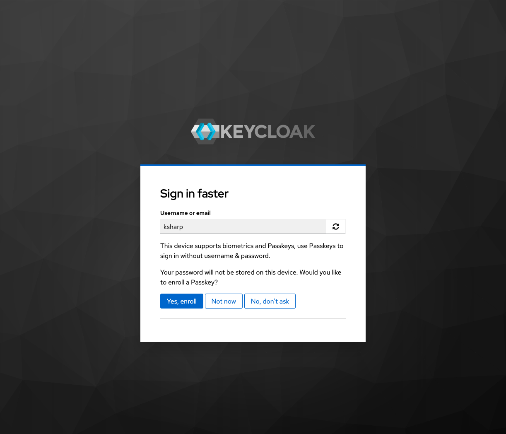

# Keycloak Extension - Encourage Passkey Enrollment  

 

As users authenticate, encourage them to set up Passkeys. This extension uses client side JavaScript to check if **the device is Passkey compatible**, if so the user is asked if they want to set up a Passkey.

If the user authenticated with a Passkey, the prompt is not shown. This works for both `WebAuthn Passwordless Authenticator` execution and the built in `Passkey` button on the username password form.

Users also have the **option to dismiss the prompt** for a configured number of days. Or just skip it for this login. Both buttons can be configured to be hidden or shown.

    

## Compatibility

|               | **v0.1.x**         |
|---------------|--------------------|
| **KC 26.5.x** | :white_check_mark: |

:white_check_mark: - Compatible  
:heavy_minus_sign: - Patch only  

## Available Executions

### Prompt User to Setup Passkey
For browser based flows, as shown above. To encourage users to configure a Passkey. Buttons are configurable to skip or delay the prompt.

### Passkey Registration
Only for forms in a registration flow. Goes after the `Registration User Profile Creation` step. When using this execution, the `Password Validation` step can be removed so the user will not be prompted for a password.  

After submitting the form, if the device is compatible a user is created with no credentials, and the user is shown a Passkey registration screen that cannot be skipped. If the device is not compatible the registration form returns an error without creating the user.

### Reset Credentials - Passkey Setup and Remove Passwords
For reset credentials flow, to be used in conjunction with `Choose User` & `Send Reset Email`, or `Username Password Form`. In both cases the execution removes the required action to reset a temporary password, and removes all credentials of type password.

A use case would be to set a user password when the user has lost all passkeys. The reset credentials flow will serve a `Username Password Form`. Once authenticated, the password is remove by the execution and the user is prompted to create a Passkey.

## Installation

1. Download the latest compatible release from the [releases page](https://github.com/HadleySo/keycloak-extension-passkey-register/releases)
2. Save the downloaded JAR file into the `providers/` directory inside Keycloak installation folder
3. Restart Keycloak 
4. Add `Prompt User to Setup Passkey` to the browser flow, after MFA or password forms

Conditional flow to check existing passkey usage is not needed.

## Configuration

**No configuration** is required.

**Re-prompt delay**:  
Days to wait before asking when user selects 'don't ask again'.

**Enable skip for this login**:  
Enable skipping of prompt just for this login. If enabled the 'Not now' button will be shown.

**Enable delay**:  
Enable delay of prompt for multiple days. If enabled the 'No, don't ask' button will be shown.

**Skip if user has Passkey**:  
Don't prompt if the user has any Passkeys set up, even if a Passkey was not used to authenticate.

## Templates
The [ftl templates](src/main/resources/theme-resources/templates) can be overridden. This is optional.

`passkey-prompt.ftl` - checks if the client has a user-verifying platform authenticator built into the client.
- Based on template.ftl from keycloak.v2 theme
- Requires a form submission with key `continueAction` and value:
    -  `setPasskey` - Enroll Passkey
    - `noAction` - Skip this time
    - `noNever` - Don't ask for 90 (or configured) days

#### Messages

Only English and German is provided, see [messages_en.properties](src/main/resources/theme-resources/messages/messages_en.properties) and [messages_de.properties](src/main/resources/theme-resources/messages/messages_de.properties).

#### Templates When Using Passkey Registration 
If Passkeys are the only method of authentication outside of credential resets, the following templates should be modified:

**webauthn-authenticate.ftl** should be modified to include `<a href="${url.loginResetCredentialsUrl}">${msg("doForgotPassword")}</a>` and `a href="${url.registrationUrl}">${msg("registerLink")}</a>`

**login.ftl** should be modified to remove the registration URL and Forgot Password link.

Messages for `loginTitle` and `doForgotPassword` should be modified.

## License  

Keycloak QR Code Authentication (keycloak-extension-passkey-register / com.hadleyso.keycloak.keyprompt) is distributed under [GNU Affero General Public License v3.0](https://www.gnu.org/licenses/agpl-3.0.txt). Copyright (c) 2026 Hadley So.

